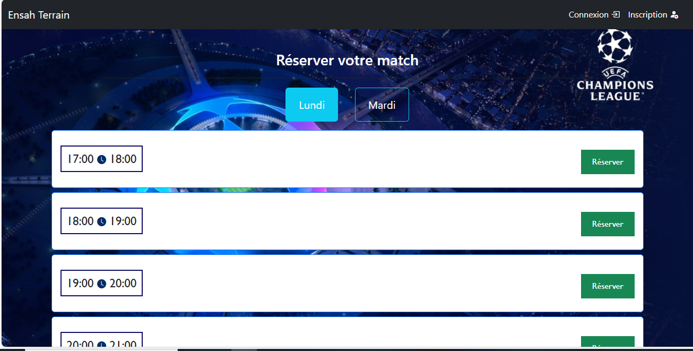
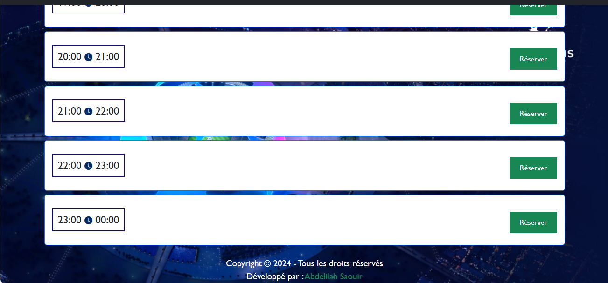
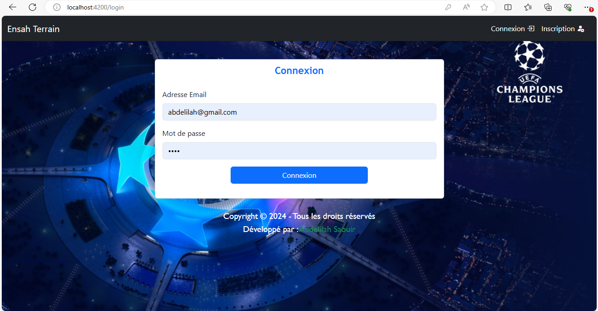
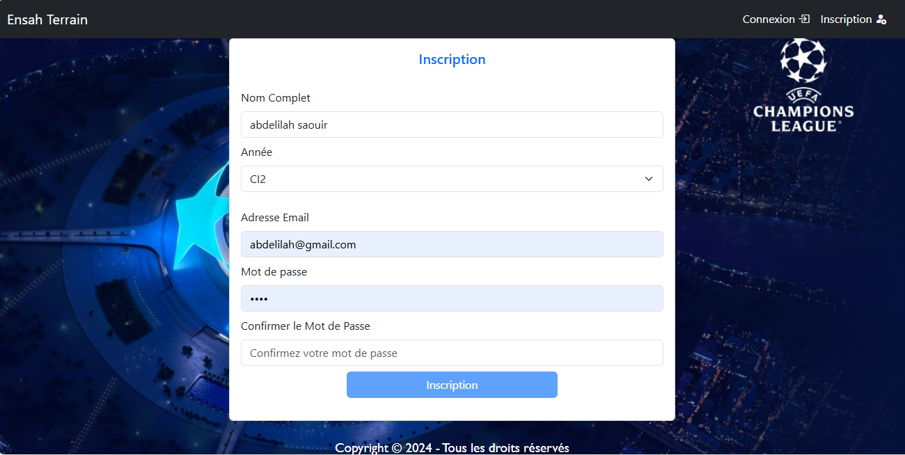

# Terrainensah

### Front-end part of the terrain reservation project (angular 2)

## Images

 

 

 

For the back-end part, you can find it [here](https://github.com/AbdelilahSaouiri/terrain-ensah-backend.git).

## Development Server

Run `ng serve` to start a development server. Navigate to `http://localhost:4200/`. The application will automatically reload if you change any of the source files.
